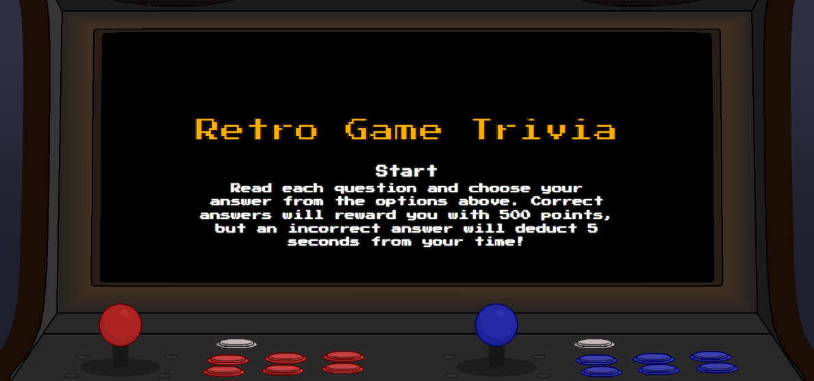

# Video Game Trivia Quiz

## Description

In order to test the functionality of local storage and javascript, I've created a small quiz that allows players to save their high scores locally. This gave me an opportunity to work with local storage, as well as practice dynamically creating and removing elements on the page, storing arrays, using stringify and parse with JSON, and laying out a page with relative positioning. 

I built this program as it is a fun way to combine one of my main interests, video games, with the topics I've been studying in web development, and this project has been a culmination of everything I have learned so far, as well as some new CSS techniques I've learned while creating this webpage. 

This was a way for me to emulate some of the styles I've seen on other pages, as well as exploring the functionality of CSS animation, and the possibilities of iterating through arrays and changing elements in the body of my HTML. 

## Installation

N/A

## Usage

Begin the game by clicking the Start button in the center of the screen. A question will appear. Click one of the four answers to proceed to the next question. Once all answers have been given, you will be given the option to enter your initials. If your score is higher than the existing high scores, your initials will be added to the high score list.

https://brian-wastle.github.io/Quiz-Game/